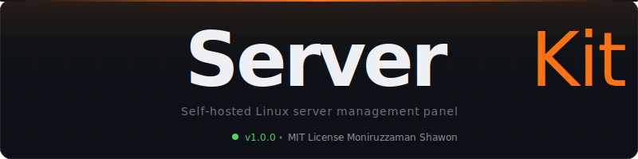

<p align="center">
  
</p>

<p align="center">
  
  
  
  
  
</p>

<br />

A self-hosted Linux server management panel built for homelab and personal server environments. ServerKit consolidates everything you need into a single, browser-based interface — real-time resource monitoring, Docker container management, file browsing, firewall control, S3 object storage, and a full browser terminal — all protected behind a secure, password-authenticated session.

---

## Features

- **Real-time system dashboard** — Live CPU, RAM, and disk statistics pushed over WebSocket every 2 seconds, with sparkline history graphs
- **Docker management** — Inspect, start, stop, restart, and remove containers; view live container logs without leaving the browser
- **Media file browser** — Navigate host directories through a path-safe browser that enforces an explicit allowlist of roots, preventing path traversal
- **Web server overview** — Status panel for Traefik-managed reverse proxy services and TLS certificates
- **Database panel** — Status and connection overview for PostgreSQL, MySQL, and SQLite instances
- **Object storage** — MinIO S3-compatible bucket management with credentials display and object counts
- **Network monitor** — UFW firewall status and active rules, all listening TCP/UDP ports with their owning processes, and Tailscale VPN status
- **Browser terminal** — Full PTY session streamed over WebSocket and rendered with xterm.js — no SSH client or key management needed
- **Settings panel** — Hostname, media roots, Docker socket path, password management, and live system information

---

## System Architecture

```
Browser
  │
  ├── HTTP + WebSocket
  │
  ▼
┌──────────────────────────────────────────────────────┐
│  Node.js Custom Server  (server.js)                  │
│                                                      │
│  ┌─────────────────────┐   ┌──────────────────────┐  │
│  │  Next.js 15         │   │  Socket.io           │  │
│  │  App Router         │   │                      │  │
│  │                     │   │  /stats namespace    │──┼──► systeminformation
│  │  Middleware (JWT)   │   │  /terminal namespace │──┼──► node-pty (PTY)
│  │  API Routes         │   │                      │  │
│  └──────────┬──────────┘   └──────────────────────┘  │
│             │                                        │
│  ┌──────────▼─────────────────────────────────────┐  │
│  │  lib/                                          │  │
│  │  ├── auth.js     JWT signing & verification    │  │
│  │  ├── docker.js   Container lifecycle via API   │  │
│  │  ├── fs.js       Path-safe directory listing   │  │
│  │  ├── shell.js    Allowlisted shell commands    │  │
│  │  └── db.js       Settings & activity log       │  │
│  └────────────────────────────────────────────────┘  │
└──────────────────────────────────────────────────────┘
          │                  │                │
          ▼                  ▼                ▼
    Docker daemon       Filesystem        SQLite
    (docker.sock)       (MEDIA_ROOTS)     (settings, activity)
```

**Authentication** — A single administrator password is configured in `.env` and can be changed at runtime through the Settings panel. Every request is validated by Next.js middleware that checks a JWT stored in an `httpOnly` cookie. Sessions are signed with HS256 and expire after 7 days.

**Real-time layer** — Socket.io shares the same HTTP server as Next.js through a custom `server.js` entry point. Two namespaces handle all real-time traffic: `/stats` pushes system telemetry every 2 seconds, and `/terminal` carries bidirectional PTY I/O.

**Security model** — The file browser enforces a strict path allowlist (`MEDIA_ROOTS` environment variable). Shell commands run through a fixed allowlist in `lib/shell.js`; anything outside it is rejected. Docker API calls are scoped to the configured socket path. All routes except `/login` and `/api/auth/login` require a valid JWT.

---

## Tech Stack

| Layer | Technology |
|---|---|
| Framework | Next.js 15 (App Router) |
| Runtime | Node.js 18+ |
| Real-time transport | Socket.io |
| Browser terminal | node-pty · xterm.js |
| System telemetry | systeminformation |
| Docker API | dockerode |
| Authentication | jose (JWT HS256) |
| Persistence | better-sqlite3 |
| Styling | Tailwind CSS |
| Testing | Vitest |

---

## Quick Start

```bash
git clone https://github.com/your-username/serverkit.git
cd serverkit
npm install
cp .env.example .env
# Open .env and set SK_PASSWORD and JWT_SECRET before continuing
npm run dev
```

Open `http://localhost:3000` and sign in with your `SK_PASSWORD`.

For full prerequisites, environment variable reference, and production deployment instructions, see the **[Installation Guide](docs/installation.md)**.

---

## Documentation

| Guide | What it covers |
|---|---|
| [Installation](docs/installation.md) | Prerequisites, environment setup, password configuration, first login, production deployment |
| [Remote Access](docs/remote-access.md) | HTTPS setup with Caddy, domain configuration, access from any device |
| [Dashboard](docs/dashboard.md) | Real-time stats, module cards, network I/O, activity log |
| [Docker](docs/docker.md) | Container list, lifecycle actions, log viewer |
| [Media Server](docs/media-server.md) | File browser, breadcrumb navigation, path allowlist configuration |
| [Web Server](docs/web-server.md) | Traefik reverse proxy, services overview |
| [Database](docs/database.md) | PostgreSQL, MySQL, and SQLite status panels |
| [Storage](docs/storage.md) | MinIO S3 buckets, object counts, credentials |
| [Network](docs/network.md) | UFW firewall rules, listening ports, Tailscale |
| [Terminal](docs/terminal.md) | Browser PTY session, keyboard shortcuts, resize behavior |
| [Settings](docs/settings.md) | General config, password management, storage credentials, system info |

---

## Author

**Moniruzzaman Shawon** — [m.zaman.djp@gmail.com](mailto:m.zaman.djp@gmail.com)

## License

MIT © 2026 Moniruzzaman Shawon — see [LICENSE](LICENSE) for details.
